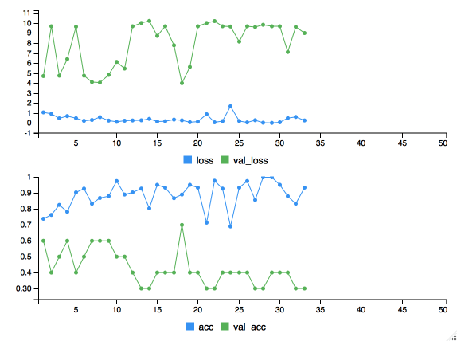

# Ex1 - ImageNet

**1. What is ImageNet?**

The following text is a brief summary of information found on ImageNet [about page](http://image-net.org/about-overview):

ImageNet is an ongoing research effort to provide researchers around the world an easily accessible image database. It consists in an image dataset organized according to the [WordNet](https://en.wikipedia.org/wiki/WordNet) hierarchy. Each meaningful concept in WordNet, potentially described by multiple words or word phrases, is called a "synonym set" or "synset". There are more than 100,000 synsets in WordNet, majority of them are nouns (80,000+). ImageNet, aims at providing images to illustrate each synset. On average there is 1000 images per synset, and each of them was quality-controlled and human-annotated. 


**2. How many different kinds of cheese can you find in ImageNet?**
 
You can find 37 different kinds of cheese on ImageNet, but are cream cheese and triple cream really cheese? Similarly grated cheese ("fromage râpé") can be any kind of cheese. So let's say that there is 37 subcategories of cheese rather than 37 kinds ;)
 
**3. What is the best classifier on ImageNet and what is its error rate?**
 
 
In December 2017, Google's [NASNet](https://arxiv.org/pdf/1707.07012.pdf) became the best Classifier on ImageNet, even though it was not part of any official ImageNet challenge. The model achieves a new performance with Top 1 Accuracy of 82.70% and Top 5 Accuracy of 96.20%.
 
 
 
# Ex. 2 — Build an image recognition system

1. Import Keras
```{r}
library(keras)
library(dplyr)
library(imager)
library(base)
```

2. Define ResNet50 as you model and check its architecture
```{r}
model <- application_resnet50(weights = 'imagenet')
#summary(model)
```

```{r}
plot_model(model)
```


For a better vizualisation of the architecture of this 50-layer residual neural network, we tried to use `plot_model(model)` but it didn't work (even if it's supposed to be [implemented](https://rdrr.io/cran/kerasR/man/plot_model.html)). This is what we obtained using the function in a Jupyter notebook (we only kept the first and last layers):

<div id="bg">
   
</div> 


3. Open an image representing a single object (if possible represented in ImageNet):

We try with a picture of emmental cheese :
```{r}
img_path <- "Img/Cheese.jpg"
img <- image_load(img_path, target_size = c(224,224))

plot(load.image(img_path))
```

4. Reshape the image to fit the input format of your model
```{r}
x <- image_to_array(img)
x <- array_reshape(x, c(1, dim(x)))
```

5. Preprocess the input
```{r}
x <- imagenet_preprocess_input(x)
```

6. Get the model predictions
```{r}
preds <- model %>% predict(x)
```

7. Display the top 5 recognized objects. Do you find the one represented on your image?
```{r}
imagenet_decode_predictions(preds, top = 5)[[1]]
```

Conclusion : The NN didn't manage to recognize this slice of cheese.

However if we try with a picture of a Golden retriever we obtain excellent results:
```{r}
img_path <- "Img/Dog.jpg"
img <- image_load(img_path, target_size = c(224,224))
plot(load.image(img_path))

x <- image_to_array(img)
x <- array_reshape(x, c(1, dim(x)))

x <- imagenet_preprocess_input(x)

preds <- model %>% predict(x)

imagenet_decode_predictions(preds, top = 5)[[1]]
```


# Ex. 3 — Your turn

1. Based on your previous work, build an binary object recognition (only two objects) by transfer learning and fine tuning.

_a) choose two classes (cat/dog or muffin/chihuahua or parrot/guacamole or livarot/pont leveque or whatever/whatever else...)_

We're going to build a **hotdog - salad classifier**. Actually we were inspired by _[Silicon Valley](https://en.wikipedia.org/wiki/Silicon_Valley_(TV_series))_'s "Hotdog/Not hotdog classifier"

_"What would you say if I told you there is a app on the market that tell you if you have a hotdog or not a hotdog. It is very good and I do not want to work on it any more. You can hire someone else." - Jian-Yang, Silicon Valley, 2017_

<iframe width="420" height="315"
src="https://www.youtube.com/embed/ACmydtFDTGs">
</iframe>


_b) download some (say 10 to 50) images of each class on the web split your images into two sets (training and testing) and setup our data with a training directory and a validation directory as follows:_

We downloaded from ImageNet a list of urls leading to pictures of salads and hotdogs.

```{r}
dir.create("salad")
dir.create("hotdog")
download.file("http://www.image-net.org/api/text/imagenet.synset.geturls?wnid=n07806774","salad/salad.txt", mode = 'wb')
download.file("http://www.image-net.org/api/text/imagenet.synset.geturls?wnid=n07697537","hotdog/hotdog.txt", mode = 'wb')
```

```{r}
salad_url = read.table("salad/salad.txt")
salad_url$V1<- as.character(salad_url$V1)
hotdog_url = read.table("hotdog/hotdog.txt")
hotdog_url$V1<- as.character(hotdog_url$V1)
```


Let's download 300 pictures of salads and 300 pictures of hotdogs
```{r}
for (i in 1:300){
  tryCatch({
    download.file(salad_url[i,],paste("salad/salad_",i,".jpg",sep=""), mode = 'wb')
    },
    
    error=function(e){
      print("error")
    })
}

for (i in 1:300){
  tryCatch({
    download.file(hotdog_url[i,],paste("hotdog/hotdog_",i,".jpg",sep=""), mode = 'wb')
    },
    
    error=function(e){
      print("error")
    })
}
#
```

Some of the pictures were corrupted and some represented more than a simple item (e.g. a salad & a glass of water), so we removed them manually from the dataset.

At the end of the day we obtain :
```{r}
f1 = list.files("hotdog",pattern=".jpg")
print(paste(length(f1), "hotdog pictures"))
f2 = list.files("salad",pattern=".jpg")
print(paste(length(f2), "salad pictures"))
```

In order not to favor any category, we're going to keep only 64 salad pictures

```{r}
f2=f2[1:min(length(f1),length(f2))]
f1=f1[1:min(length(f1),length(f2))]
print(length(f2)==length(f1))
print(length(f1))
```


We split our data into 80/20 and move it to train/test directories. The architecture of these directories is :

train_dir/
  hotdog/
  salad/
test_dir/
  hotdog/
  salad/

```{r}
dir.create("train_dir")
dir.create("train_dir/hotdog")
dir.create("train_dir/salad")
dir.create("test_dir")
dir.create("test_dir/hotdog")
dir.create("test_dir/salad")
```


```{r}
index_hotdog = sample(1:length(f1), round(0.8*length(f1)))

train_hotdog = f1[index_hotdog]
file.copy(from=paste("hotdog/",train_hotdog,sep=""),
          to=paste("train_dir/hotdog/",train_hotdog,sep=""))

test_hotdog = f1[-index_hotdog]
file.copy(from=paste("hotdog/",test_hotdog,sep=""),
          to=paste("test_dir/hotdog/",test_hotdog,sep=""))


index_salad = sample(1:length(f2), round(0.8*length(f2)))

train_salad = f2[index_salad]
file.copy(from=paste("salad/",train_salad,sep=""),
          to=paste("train_dir/salad/",train_salad,sep=""))

test_salad = f2[-index_salad]
file.copy(from=paste("salad/",test_salad,sep=""),
          to=paste("test_dir/salad/",test_salad,sep=""))
#
```

_c) training the network_

We initially tried to use an Xception pre-trained neural net in order to build our model, but we fail to tune the hyperparameters (we also tried to add more data and try to [augment it](https://towardsdatascience.com/image-augmentation-for-deep-learning-histogram-equalization-a71387f609b2)) ... These are the final results we obtained with Xception :
<div id="bg">
  
</div> 

So we moved to VGG 16 :

```{r}

### Defining training and testing sets

f1 = list.files("hotdog",pattern=".jpg")
f2 = list.files("salad",pattern=".jpg")

img_width = 150
img_height = 150
batch_size = 10

train_directory = "train_dir"
test_directory = "test_dir"
 
train_generator = flow_images_from_directory(
                              train_directory, 
                              generator = image_data_generator(),
                              target_size = c(img_width, img_height),
                              color_mode = "rgb",
                              class_mode = "categorical", 
                              batch_size = batch_size,
                              shuffle=TRUE,
                              seed = 42 )


validation_generator = flow_images_from_directory(
                                    test_directory,
                                    generator = image_data_generator(),                                                                        target_size = c(img_width, img_height),
                                    color_mode = "rgb",
                                    classes = NULL,
                                    class_mode = "categorical",
                                    batch_size = batch_size,
                                    shuffle = TRUE,
                                    seed = 42)

train_samples = round(0.8*length(f1))
validation_samples = round(0.2*length(f1))


### Defining the pretrained model : VGG16

base_model <- application_vgg16(weights = 'imagenet',
                                include_top = FALSE, ## We drop the final layer (i.e. the prediction layer)
                                input_shape = c(img_width, img_height, 3))
 

### Adding one more layer

predictions <- base_model$output %>% 
                      layer_global_average_pooling_2d(trainable = T) %>% 
                      layer_dense(128, trainable = T) %>% #128 fully connected neurons
                      layer_activation("relu", trainable = T) %>% #ReLU activation function
                      layer_dropout(0.5, trainable = T) %>% #Dropping-out 50% of the  intermediary results 
                                                            #to avoid overfitting
                      layer_dense(2, trainable=T) %>% # We add 1 more layer with only 2 neuros = 2 classes
                      layer_activation("softmax", trainable=T) # The out_put function is softmax
 

### The model to train

model <- keras_model(inputs = base_model$input, outputs = predictions)


### Freezing all layers previously trained by VGG16

for (layer in base_model$layers){
  layer$trainable <- FALSE
}
  
 
### Let's do the maths

model %>% compile(
  loss = "categorical_crossentropy",
  optimizer = optimizer_rmsprop(lr = 0.005, decay = 1e-6), #learning rate of 0.005
  metrics = "accuracy"
)
 
results <- model %>% fit_generator(
                          train_generator,
                          steps_per_epoch = as.integer(train_samples/batch_size), 
                          epochs = 20, # 20 epochs
                          validation_data = validation_generator,
                          validation_steps = as.integer(validation_samples/batch_size),
                          verbose=2
)

keras::save_model_hdf5(model,"model.hdf5")
```


Here are the results we obtained. At the best of the learning process we achieved 0.96 of accuracy and 0.97 of validation accuracy.

```{r}
plot(results)
```


**Bonus:** This is the chunk of code we used to augment the data when Xception wouldn't work ...
```{r}

### Generating "new" data out of the original data by rotating/translating/croping/resizing/... it

datagen <- image_data_generator(
  rotation_range = 20,
  width_shift_range = 0.2,
  height_shift_range = 0.2,
  horizontal_flip = TRUE
)
 
train_augmented_generator <-  flow_images_from_directory(test_directory, 
                                                         generator = datagen,
                                                         target_size = c(img_width, img_height), 
                                                         color_mode = "rgb", 
                                                         classes = NULL, 
                                                         class_mode = "categorical", 
                                                         batch_size = batch_size, 
                                                         shuffle = TRUE,  
                                                         seed = 42)

### The model to train

model <- keras_model(inputs = base_model$input, outputs = predictions)

for (layer in base_model$layers){
  layer$trainable <- FALSE
}


### Training on the augmented data

result_aug <- model %>% fit_generator(
  train_augmented_generator,
  steps_per_epoch = as.integer(train_samples/batch_size), 
  epochs = 20, 
  validation_data = validation_generator,
  validation_steps = as.integer(validation_samples/batch_size),
  verbose=2
)
```


**Let's visualize the results of our model**

We test our model on :

* A regular hotdog
* A regular salad
* Snapchat's dancing hotdog
* A salad with a hotdog


<iframe width="420" height="315"
src="https://www.youtube.com/embed/s_LkzU5gDZI">
</iframe>


```{r}
img_list = c("hotdog.png","salad.jpg","snap.png","hotdog_salad.jpg")
img_path_list = paste("Img/",img_list,sep="")

for (img_path in img_path_list){
  img <- image_load(img_path, target_size = c(150,150))
  plot(load.image(img_path))
  x <- image_to_array(img)
  x <- array_reshape(x, c(1, dim(x)))
  x <- imagenet_preprocess_input(x)
  preds <- model %>% predict(x)
  if (preds[,1]==1){
    print("Hotdog")
  } else {
    print("Salad")
  }
}
```

As expected we predicted well on regular usecases. Yet in the tricky case of a salad + a hotdog our classifier predicted a salad rather than a hotdog.


2. Is it better to do transfer learning and fine tuning or both?

We obtained these few guidelines from [Deep Learning Sandbox](https://deeplearningsandbox.com/how-to-use-transfer-learning-and-fine-tuning-in-keras-and-tensorflow-to-build-an-image-recognition-94b0b02444f2)


* **Similar & small dataset:** avoid overfitting by not fine-tuning the weights on a small dataset, and use extracted features from the highest levels of the ConvNet to leverage dataset similarity.
* **Different & small dataset:** avoid overfitting by not fine-tuning the weights on a small dataset, and use extracted features from lower levels of the ConvNet which are more generalizable.
* **Similar & large dataset:** with a large dataset we can fine-tune the weights with less of a chance to overfit the training data.
* **Different & large dataset:** with a large dataset we again can fine-tune the weights with less of a chance to overfit.


<div id="bg">
  
</div> 


# On our way to make money !
<iframe width="420" height="315"
src="https://www.youtube.com/embed/AJsOA4Zl6Io">
</iframe>


